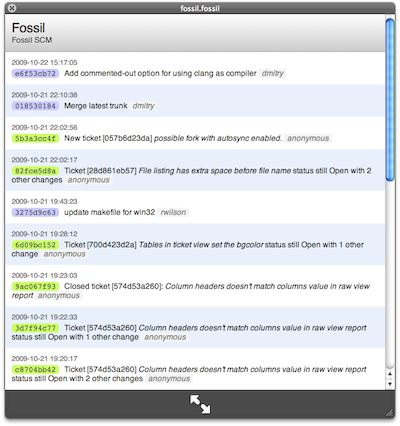

QLFossil
========

About QLFossil
--------------

QLFossil is a Quick Look plugin for Mac OS X to display
[Fossil](http://www.fossil-scm.org) repositories. It displays repository name,
description, last sync URL, and timeline in Quick Look thumbnails and previews.

Download
--------

See [Releases](https://github.com/dchest/qlfossil/releases).

Installation
------------

Unzip, then copy `QLFossil.qlgenerator` to `~/Library/QuickLook/` (create this
folder if it doesn't exist) or `/Library/QuickLook/`. Probably, you'll need to
restart your Mac.

**Requirements:** QLFossil is compatible with Mac OS X 10.5 and later.
It doesn't require Fossil to be installed, it reads data directly from
repositories.

Usage
-----

Locate Fossil repository (not working copy!) in Finder and press Space. BOOM!

QLFossil understands repositories with `.fossil` and `.fsl` extensions.
Currently it doesn't know anything about tags or branches, it displays just a
dumb timeline of events.
